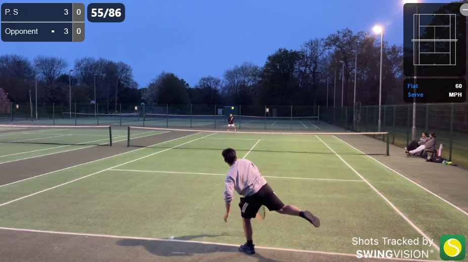
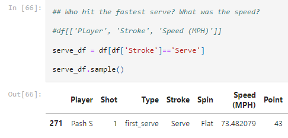

# SwingVision---A-data-science-project

## Welcome to my tennis match analysis project!

## Table of Contents
1. [Introduction](#introduction)
2. [Features](#features)
3. [Installation](#installation)
4. [Usage](#usage)
5. [Contributing](#contributing)
6. [License](#license)

### Introduction

##What is Swing Vision?

SwingVision is an AI-powered app for tennis players that provides detailed performance analysis.

### Let's see who had the fastest serve in that game.

Here is a sneak peek of what I am working on:

This image shows the fastest serve in the game: ST vs PS.

Link to the [Swing Vision match](https://swing.vision/matches/2b1cd6b2-7b15-41e4-893e-07050787d89b) 
